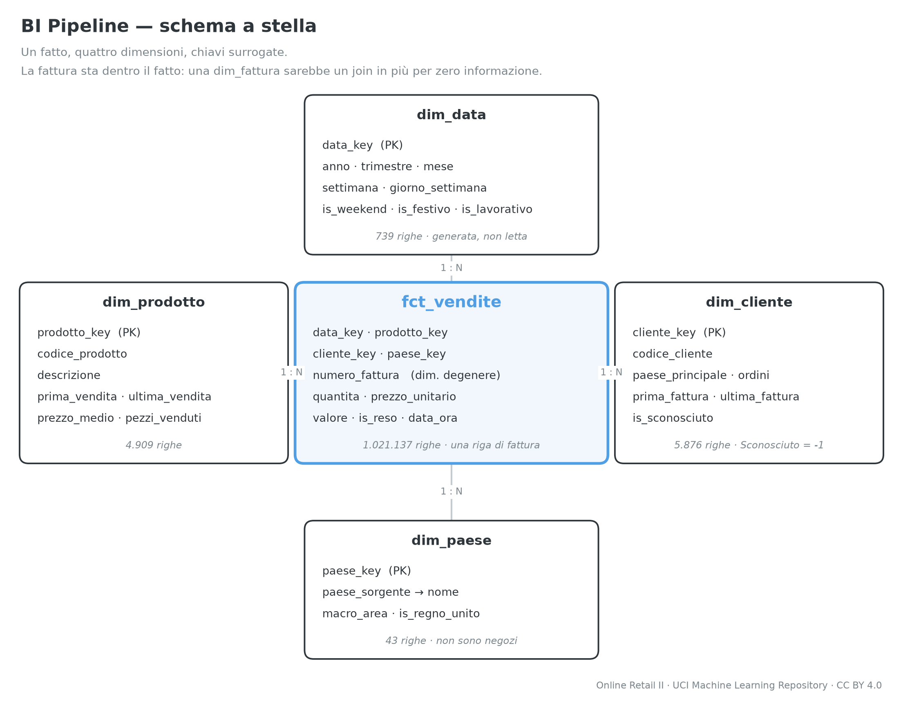
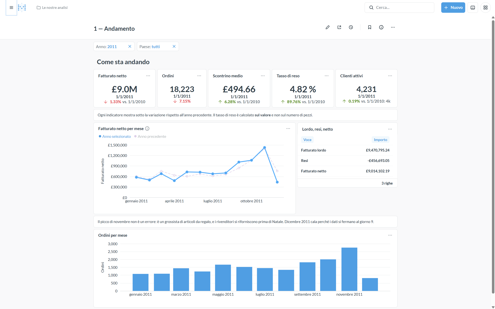

# BI Pipeline

Un milione di righe di vendite grezze entrano da un file, escono da un cruscotto
con cinque indicatori, e in mezzo attraversano quattro strati che si possono
rilanciare uno per uno senza sporcare niente.

[](https://github.com/imadelmir/bi-pipeline/actions/workflows/ci.yml)

**Python · PostgreSQL · dbt · Prefect · Docker · Metabase**

---

## In breve

| | |
|---|---|
| **Problema** | Un file Excel da un milione di righe di vendite non si interroga, non si verifica e non si aggiorna |
| **Il mio ruolo** | Progetto personale, costruito da solo: ingestione, modellazione dbt, orchestrazione, cruscotti |
| **Risultato** | 1.067.371 righe caricate, 46.234 escluse con il motivo contato, 109 test verdi, tutto in 54 s |
| **Stack** | Python · PostgreSQL · dbt · Prefect · Docker · Metabase |
| **Demo** | [Case study con le schermate dei cruscotti](https://portfolio-imad-el-mir.vercel.app/it/projects/bi-pipeline) |
| **Avvio** | `make up` per i servizi, `make flow` per l'intera pipeline — [istruzioni](#avvio-in-locale) |
| **Stato** | Completato (agosto 2026) |

### I numeri

| | |
| --- | ---: |
| Righe caricate | **1.067.371** |
| Righe nel fatto, dopo la pulizia | **1.021.137** |
| Righe escluse, contate una per una | **46.234** |
| Test automatici, tutti verdi | **109** |
| Caricamento con `COPY` | **7,9 s** |
| `COPY` contro `pandas.to_sql` | **17,6 volte più veloce** |
| Dalla sorgente ai cruscotti, un comando | **54 s** |

Ogni numero di questo repository è **misurato su questa macchina**, non
stimato. Da dove viene sta scritto nelle
[relazioni di milestone](docs/milestones/).

## Cosa fa

Una pipeline **ELT** su dati di vendita veri:

```
online_retail_II.xlsx ──► raw ──► staging ──► marts ──► cruscotti
       Python           Postgres    dbt        dbt       Metabase
```

| Strato | Strumento | Regola invariabile |
| --- | --- | --- |
| `raw` | Python + `COPY` | Nessuna trasformazione: se il dato è sporco, entra sporco |
| `staging` | dbt, viste | Tipi, nomi, pulizia, deduplica. Un modello per sorgente, nessun join |
| `marts` | dbt, tabelle | Schema a stella: un fatto e quattro dimensioni. Solo qui nascono le chiavi |
| presentazione | Metabase | Nessuna logica di business nei grafici: se serve un calcolo, si fa in dbt |

Ogni strato è **idempotente**: rilanciarlo non duplica niente. Tre esecuzioni
consecutive dell'ingestione lasciano sempre 1.067.371 righe.



## I cruscotti

Tre pagine, quindici schede, due filtri comuni — e **nessuna costruita a clic**:
le domande sono definite in [`metabase/domande.py`](metabase/domande.py) e si
ricostruiscono con `make cruscotti`.

| Pagina | Cosa mostra |
| --- | --- |
| **Andamento** | I cinque indicatori con la variazione sull'anno prima, la serie mensile, la scomposizione lordo → resi → netto |
| **Prodotti e clienti** | I primi dodici prodotti, la distribuzione dello scontrino, i clienti per fatturato, i prodotti che tornano indietro |
| **Geografia** | Il fatturato per paese senza il Regno Unito, mercato interno contro estero, la scheda Italia |



Le altre due pagine sono in [`docs/screenshot/`](docs/screenshot/).

I cinque indicatori sul periodo intero:

| Indicatore | Valore |
| --- | ---: |
| Fatturato netto | £ 18.927.523 |
| Ordini | 39.516 |
| Scontrino medio | £ 478,98 |
| Tasso di reso (sul valore) | 3,64 % |
| Clienti attivi | 5.875 |

**Non c'è una demo online**, ed è una decisione motivata: vedi i
[limiti dichiarati](#limiti-dichiarati).

## La sorgente

**Online Retail II** — tutte le transazioni di un grossista inglese di articoli
da regalo, dal 01/12/2009 al 09/12/2011.

Licenza **CC BY 4.0**: il riuso è libero a condizione di citare la fonte.

> Chen, D. (2012). *Online Retail II* [Dataset]. UCI Machine Learning
> Repository. <https://doi.org/10.24432/C5CG6D>

Il file **non è nel repository**: pesa 43,5 MB e in git resterebbe per sempre.
Si scarica con `make ingest`, che ne verifica lo SHA-256 prima di caricarlo.

## Prerequisiti

| Strumento | Versione | Nota |
| --- | --- | --- |
| [Docker](https://docs.docker.com/get-docker/) | con Compose v2 | Alza PostgreSQL e Metabase |
| [uv](https://docs.astral.sh/uv/) | ≥ 0.12 | Gestisce Python e le dipendenze |
| Python | 3.12 | Lo installa `uv` da solo: non serve averlo già |
| `make` | GNU Make | Su Windows c'è `.\make.ps1 <comando>`, senza installare niente |

## Avvio in locale

```bash
git clone https://github.com/imadelmir/bi-pipeline.git
cd bi-pipeline

cp .env.example .env                  # poi si riempiono i valori
cp dbt/profiles.yml.example dbt/profiles.yml
git config core.hooksPath .githooks   # attiva i controlli prima del commit
uv sync                               # Python 3.12 e le versioni bloccate

make up                               # PostgreSQL e Metabase su Docker
make ingest                           # scarica, verifica il checksum, carica
make build TARGET=prod                # modelli e test
make cruscotti                        # utente di lettura, domande, cruscotti
```

Poi Metabase è su <http://localhost:3000>, con le credenziali scritte in `.env`.

Oppure, in un colpo solo:

```bash
make flow                             # scaricamento, caricamento, modelli, test
```

## I comandi

| Comando | Cosa fa |
| --- | --- |
| `make up` / `make down` | Alza e ferma i servizi Docker |
| `make ingest` | Scarica, verifica il checksum e carica in `raw` con `COPY` |
| `make build` | `dbt build`: modelli e test insieme (`TARGET=dev` di default) |
| `make test` | Solo i test, senza ricostruire i modelli |
| `make flow` | Il flusso Prefect completo, con i tempi di ogni passo |
| `make cruscotti` | Prepara Metabase e ricostruisce domande e cruscotti |
| `make docs` | Documentazione dbt e lineage nel browser |
| `make psql` | `psql` dentro il contenitore, senza installarlo |
| `make check` | Formato, lint e tipi: gli stessi controlli della CI |
| `make profila` | Riconta lo sporco della sorgente |
| `make confronto` | Cronometra `COPY` contro `pandas.to_sql` |

## Come è fatto dentro

### Nessuna riga sparisce in silenzio

Fra `raw` e il fatto se ne perdono 46.234, e ognuna è contata con il suo
motivo:

| Motivo | Righe |
| --- | ---: |
| Duplicati esatti | 34.153 |
| Prezzo non positivo | 6.168 |
| Codici di servizio (spedizioni, commissioni, rettifiche) | 5.913 |
| **Totale escluse** | **46.234** |
| **Righe tenute** | **1.021.137** |

La somma torna a 1.067.371, e c'è **un test che lo pretende**: se un giorno non
tornasse, `dbt build` diventa rosso invece di lasciare un cruscotto che mente.

### Lo schema a stella

Un fatto alla grana della riga di fattura e quattro dimensioni: `dim_data`
(739 giorni **generati**, festivi del Regno Unito compresi), `dim_prodotto`
(4.909), `dim_cliente` (5.876, con il membro *Sconosciuto* a chiave `-1` per il
22 % di righe senza codice cliente), `dim_paese` (43, normalizzati con una
tabella di raccordo versionata).

Il fatto è **incrementale**: la seconda esecuzione elabora 1.616 righe invece
di un milione, e il totale resta identico a una ricostruzione completa.

### I test

109 test dbt: `unique` e `not_null` sulle chiavi, `relationships` dal fatto
verso ogni dimensione, `accepted_values` sui booleani, e tre test scritti a
mano — prezzo positivo, coerenza dei resi, e **la quadratura dei totali**,
quello che si accorge se delle righe spariscono lungo la strada.

La CI non controlla solo il codice: alza un PostgreSQL, scarica la sorgente
vera, carica il milione di righe ed esegue tutto. **Su un runner vuoto produce
gli stessi identici numeri di questa macchina.**

## Struttura

```
ingestion/      Python: scaricamento, checksum, COPY verso raw, registro
dbt/            Modelli, test, seed e macro delle trasformazioni
orchestration/  Il flusso Prefect che mette in fila tutto
metabase/       I cruscotti definiti in codice, e cosa contiene ogni pagina
scripts/        Diagramma, festivi, utente di lettura, backlog su GitHub
docs/
├── milestones/       Una relazione per milestone, con i numeri misurati
├── decisioni.md      Le decisioni tecniche e le alternative scartate
├── profilazione.md   Lo sporco della sorgente, contato
└── confronto-*.md    COPY contro to_sql, e gli indici misurati
```

## Limiti dichiarati

- **Il margine non è calcolabile.** Serve il costo d'acquisto e nessun dataset
  pubblico lo contiene. Inventare una colonna `cost` renderebbe finto tutto il
  cruscotto.
- **Niente dimensioni a evoluzione lenta.** Esiste una sola fotografia dei
  prodotti: storicizzarla vorrebbe dire registrare cambiamenti mai avvenuti. Al
  loro posto ci sono i modelli incrementali, che questi dati reggono davvero
  perché sono ordinati nel tempo.
- **Non ci sono negozi.** È un rivenditore che vende solo online: la geografia è
  per paese, e i paesi si chiamano paesi.
- **Nessuna demo online.** Il database pesa **491 MB** (190 MB il solo
  `marts`): non sta nei piani gratuiti che offrano anche un motore di
  interrogazione sempre acceso, e Metabase Cloud non ne ha uno. Pubblicare una
  fetta ridotta avrebbe significato mostrare numeri diversi da quelli del case
  study. Ci sono invece gli screenshot dei tre cruscotti, e chi vuole i numeri
  veri li ottiene con quattro comandi: la pipeline si ricostruisce da zero.
- **L'aspetto di Metabase non è personalizzabile** nell'edizione open source:
  font e colori dell'interfaccia sono dietro una funzione a pagamento. Colori
  delle serie, formati dei numeri e testi delle schede invece sì, e sono tutti
  definiti in codice.

## Licenza

Codice: [MIT](LICENSE). Dati: CC BY 4.0, con l'attribuzione riportata sopra.
